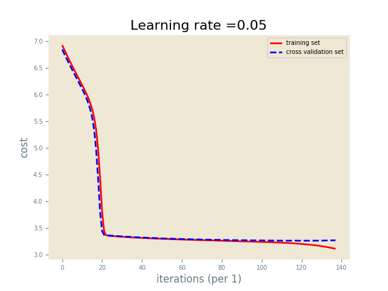

# deep-neural-network-classifier 
### Ready to train, configurable, neutral network model coded in Python stanard library and numpy for matrix operations.

##### Features :
- initialization: providing a shape of layers, biases are initialized to zeros and weights using available initializers:
    - random normal
    - random uniform
    - he initialization (recommendable for ReLU hidden layers)
    - Xavier initialization
- Plug your data and train unregularized model, during training learning curves can be plotted.
- Model can save/load learned params. 
- Use ```predict``` method to evaluate test examples.


#### Setup:
- Model initialization requires one argument - array of neurons per layer. 
    ```
    layer_dims=[#features, #1st_hidden_layer_neurons,..., #nth_hidden_layer_neurons, #classes]
    model = Model(layer_dims)
    ```

- call train method with: 
    - traing input - 2d array of ```shape=(#features, #exaples)```
    - training output - 2d array of ```shape=(#classes, #examples)```  
    
### [Example](https://github.com/BRadTone/deep-neural-network-classifier/tree/master/example):

1. Prepare data:
    ```python
    with gzip.open('mnist.pkl.gz', 'rb') as f:
        train_set, valid_set, test_set = pickle.load(f, encoding='latin1')
    
    train_x, train_y = train_set
    valid_x, valid_y = valid_set
    test_x, test_y = test_set
    
    if __name__ == '__main__':
    # get useful variables
    m = train_x.shape[0]
    m_test = test_x.shape[0]
    
    # map train_y to output vector, one-hot-encoding
    Y = ints_to_binary_vec(train_y.reshape(1, m), 10)
    Y_valid = ints_to_binary_vec(valid_y.reshape(1, m_test), 10)
    
    # normalize data
    X = normalize(train_x)
    X_valid = normalize(test_x)
    ```
    
2. Define hyperparameters:
    ```python
    hyp_params = {
            'epochs': 100,
            'learning_rate': 0.05,
            'print_cost': True
        }
    ```

3. Initialize model and train:
    ```python
    model = Model(layers_dims=[X.shape[1], 100, 100, Y.shape[0]])

    model.train(X.T, Y, X_valid.T, Y_valid, **hyp_params)
    ```
    - Watch learning curves during iterations
     
    
4. Save learned paramaters returned by train method:
    ```python
     pickle_name = 'saved_models/model-alpha-{0}-iterations-{1}-layers-{2}.pickle' \
            .format(hyp_params['learning_rate'], hyp_params['epochs'], str(hyp_params['layers_dims']))
    
     pickle_model(pickle_name, model)
    ```
